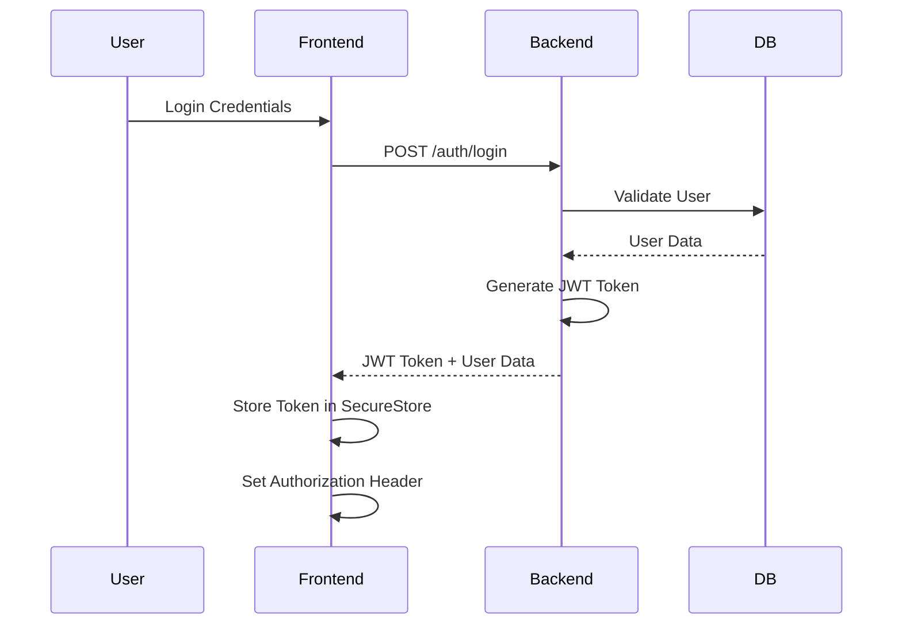
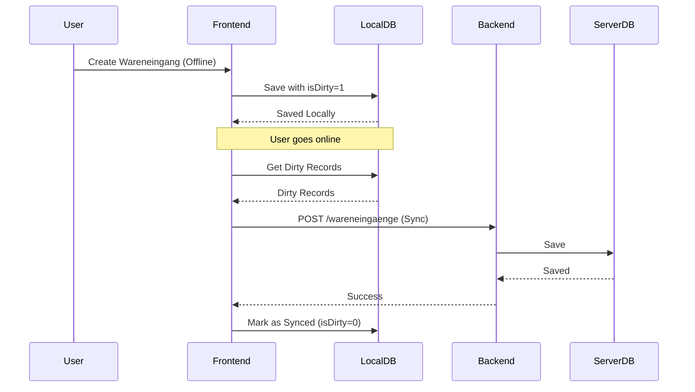
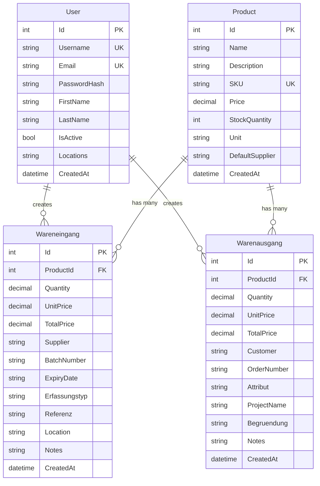

# Warenbuchung App - Architekturdiagramm

## Gesamtarchitektur

```mermaid
graph TB
    subgraph Frontend["📱 Frontend - React Native (Expo)"]
        subgraph Navigation["Navigation Layer"]
            App["App.tsx<br/>Root Component"]
            StackNav["Stack Navigator<br/>(@react-navigation/stack)"]
            TabNav["Tab Navigator<br/>(@react-navigation/bottom-tabs)"]
        end
        
        subgraph Screens["Screens"]
            Login["LoginScreen"]
            Register["RegisterScreen"]
            Main["MainScreen"]
            Products["ProductsScreen"]
            AddProduct["AddProductScreen"]
            Wareneingaenge["WareneingaengeScreen"]
            AddWE["AddWareneingangScreen"]
            Warenausgaenge["WarenausgaengeScreen"]
            Profile["ProfileScreen"]
            ProjectMaterials["ProjectMaterialsScreen"]
            ItemHistory["ItemHistoryScreen"]
        end
        
        subgraph Services["Services Layer"]
            ApiService["api.ts<br/>- Axios HTTP Client<br/>- JWT Token Management<br/>- API Interceptors"]
            DatabaseService["database.ts<br/>- SQLite Operations<br/>- Offline Storage<br/>- Sync Queue"]
        end
        
        subgraph Storage["Local Storage"]
            SecureStore["Expo Secure Store<br/>- Auth Token<br/>- User Data"]
            SQLite["Expo SQLite<br/>- Products<br/>- Wareneingaenge<br/>- Warenausgaenge<br/>- Sync Queue"]
        end
    end
    
    subgraph Backend["🔧 Backend - ASP.NET Core 8.0"]
        subgraph Controllers["API Controllers"]
            AuthCtrl["AuthController<br/>POST /auth/login<br/>POST /auth/register<br/>GET /auth/me"]
            ProductCtrl["ProductsController<br/>GET /products<br/>POST /products<br/>PUT /products/{id}<br/>DELETE /products/{id}"]
            WECtrl["WareneingaengeController<br/>GET /wareneingaenge<br/>POST /wareneingaenge<br/>PUT /wareneingaenge/{id}<br/>DELETE /wareneingaenge/{id}"]
            WACtrl["WarenausgaengeController<br/>GET /warenausgaenge<br/>POST /warenausgaenge<br/>PUT /warenausgaenge/{id}<br/>DELETE /warenausgaenge/{id}"]
            HealthCtrl["HealthController<br/>GET /health"]
        end
        
        subgraph Middleware["Middleware"]
            JWT["JWT Bearer Authentication<br/>Token Validation"]
            CORS["CORS Policy<br/>Allow React Native"]
            Swagger["Swagger/OpenAPI<br/>API Documentation"]
        end
        
        subgraph DataLayer["Data Access Layer"]
            DbContext["WarenbuchungDbContext<br/>Entity Framework Core"]
            Models["Models<br/>- User<br/>- Product<br/>- Wareneingang<br/>- Warenausgang"]
            Migrations["EF Migrations<br/>Database Schema"]
        end
        
        subgraph Database["Database"]
            SQLiteDB["SQLite Database<br/>(warenbuchung.db)"]
        end
        
        subgraph DTOs["DTOs (Data Transfer Objects)"]
            AuthDto["AuthDto"]
            ProductDto["ProductDto"]
            WEDto["WareneingangDto"]
            WADto["WarenausgangDto"]
        end
    end
    
    %% Frontend connections
    App --> StackNav
    StackNav --> Login
    StackNav --> Register
    StackNav --> Main
    StackNav --> ProjectMaterials
    StackNav --> ItemHistory
    
    Main --> TabNav
    TabNav --> Products
    TabNav --> Wareneingaenge
    TabNav --> Warenausgaenge
    TabNav --> Profile
    
    Products --> AddProduct
    Wareneingaenge --> AddWE
    
    %% Services connections
    Login --> ApiService
    Register --> ApiService
    Main --> ApiService
    Products --> ApiService
    Wareneingaenge --> ApiService
    Warenausgaenge --> ApiService
    AddProduct --> ApiService
    AddWE --> ApiService
    
    ApiService --> SecureStore
    ApiService --> DatabaseService
    DatabaseService --> SQLite
    
    %% Backend connections
    AuthCtrl --> JWT
    ProductCtrl --> JWT
    WECtrl --> JWT
    WACtrl --> JWT
    
    AuthCtrl --> DbContext
    ProductCtrl --> DbContext
    WECtrl --> DbContext
    WACtrl --> DbContext
    
    DbContext --> Models
    DbContext --> SQLiteDB
    Migrations --> SQLiteDB
    
    AuthCtrl --> AuthDto
    ProductCtrl --> ProductDto
    WECtrl --> WEDto
    WACtrl --> WADto
    
    %% Frontend-Backend communication
    ApiService -.HTTP/REST.-> AuthCtrl
    ApiService -.HTTP/REST.-> ProductCtrl
    ApiService -.HTTP/REST.-> WECtrl
    ApiService -.HTTP/REST.-> WACtrl
    ApiService -.HTTP/REST.-> HealthCtrl
    
    %% Styling
    classDef frontend fill:#e1f5ff,stroke:#01579b,stroke-width:2px
    classDef backend fill:#fff3e0,stroke:#e65100,stroke-width:2px
    classDef database fill:#f3e5f5,stroke:#4a148c,stroke-width:2px
    classDef service fill:#e8f5e9,stroke:#1b5e20,stroke-width:2px
    
    class App,StackNav,TabNav,Login,Register,Main,Products,AddProduct,Wareneingaenge,AddWE,Warenausgaenge,Profile,ProjectMaterials,ItemHistory frontend
    class AuthCtrl,ProductCtrl,WECtrl,WACtrl,HealthCtrl,JWT,CORS,Swagger,DbContext,Models,Migrations,AuthDto,ProductDto,WEDto,WADto backend
    class SecureStore,SQLite,SQLiteDB database
    class ApiService,DatabaseService service
```

## Detaillierte Komponentenübersicht

### Frontend-Architektur

#### **Navigation Structure**
- **Stack Navigator**: Hauptnavigation zwischen Login, Register, Main und Detail-Screens
- **Tab Navigator**: Hauptnavigation innerhalb der App (Wareneingaenge, Warenausgaenge, Products, Profile)

#### **Services**
1. **ApiService (api.ts)**
   - Axios-basierter HTTP Client
   - JWT Token Management (Automatic Token Injection)
   - Request/Response Interceptors
   - API Methoden für alle Ressourcen
   - Authentication Status Management

2. **DatabaseService (database.ts)**
   - SQLite Database Initialization
   - Offline-First Datenhaltung
   - Sync Queue für Offline-Änderungen
   - CRUD Operations für alle Entitäten

#### **Storage**
- **Expo Secure Store**: Sichere Speicherung von JWT Tokens und User-Daten
- **Expo SQLite**: Lokale Offline-Datenbank für Produkte, Wareneingaenge, Warenausgaenge

### Backend-Architektur

#### **Controllers (REST API Endpoints)**
- **AuthController**: Benutzer-Authentifizierung und -Registrierung
- **ProductsController**: Produktverwaltung (CRUD)
- **WareneingaengeController**: Wareneingangsverwaltung
- **WarenausgaengeController**: Warenausgangsverwaltung
- **HealthController**: Health Check Endpoint

#### **Middleware Stack**
1. **JWT Bearer Authentication**: Token-basierte Authentifizierung
2. **CORS**: Cross-Origin Resource Sharing für React Native
3. **Swagger/OpenAPI**: API-Dokumentation und Testing

#### **Data Layer**
- **WarenbuchungDbContext**: Entity Framework Core DbContext
- **Models**: Domain Models (User, Product, Wareneingang, Warenausgang)
- **Migrations**: Database Schema Versionierung

#### **Database**
- **SQLite**: File-based Database (warenbuchung.db)

### Datenfluss

#### **Authentication Flow**

#### **Data Synchronization Flow**

## Technologie-Stack

### Frontend
- **Framework**: React Native 0.81.5 mit Expo 54.0.21
- **Language**: TypeScript 5.9.2
- **Navigation**: React Navigation 7.x (Stack + Bottom Tabs)
- **UI Library**: React Native Paper 5.14.5
- **HTTP Client**: Axios 1.12.2
- **Storage**: 
  - Expo Secure Store (für Auth Tokens)
  - Expo SQLite (für Offline-Daten)
- **Barcode Scanner**: Expo Barcode Scanner 13.0.1
- **Camera**: Expo Camera 17.0.8

### Backend
- **Framework**: ASP.NET Core 8.0 (Web API)
- **Language**: C#
- **ORM**: Entity Framework Core 9.0.9
- **Database**: SQLite
- **Authentication**: JWT Bearer Tokens (BCrypt für Password Hashing)
- **API Documentation**: Swagger/OpenAPI
- **CORS**: Konfiguriert für React Native

## Datenmodell

### Entity Relationships

## Deployment

### Backend
- **Platform**: Railway / Docker
- **Database**: SQLite (file-based, in Production persistent volume)
- **Environment Variables**: JWT Keys, Connection Strings

### Frontend
- **Platform**: Expo (iOS/Android/Web)
- **Build**: EAS Build (Expo Application Services)
- **Distribution**: App Store / Google Play Store

