# Warenbuchung App - Vereinfachtes Architekturdiagramm

## Übersicht - High-Level Architektur

```mermaid
graph LR
    subgraph Mobile["📱 Mobile App (React Native)"]
        UI[Benutzeroberfläche]
        API[API Service]
        DB[(Lokale SQLite DB)]
    end
    
    subgraph Server["🌐 Backend Server (ASP.NET Core)"]
        REST[REST API]
        AUTH[JWT Auth]
        EF[Entity Framework]
        DB2[(SQLite Database)]
    end
    
    UI --> API
    API <-->|HTTP/REST| REST
    API --> DB
    REST --> AUTH
    REST --> EF
    EF --> DB2
    
    style Mobile fill:#e3f2fd
    style Server fill:#fff3e0
    style DB fill:#f3e5f5
    style DB2 fill:#f3e5f5
```



## Detaillierte Komponentenstruktur

```mermaid
graph TD
    subgraph Frontend["FRONTEND - React Native Expo App"]
        direction TB
        Screens["📱 Screens<br/>━━━━━━━━━━━━━━━━━<br/>• LoginScreen<br/>• RegisterScreen<br/>• MainScreen<br/>• ProductsScreen<br/>• WareneingaengeScreen<br/>• WarenausgaengeScreen<br/>• ProfileScreen<br/>• ProjectMaterialsScreen<br/>• ItemHistoryScreen"]
        
        Services["⚙️ Services<br/>━━━━━━━━━━━━━━━━━<br/>• ApiService (axios)<br/>• DatabaseService (SQLite)"]
        
        Storage["💾 Storage<br/>━━━━━━━━━━━━━━━━━<br/>• Secure Store (Tokens)<br/>• SQLite (Offline Data)"]
    end
    
    subgraph Backend["BACKEND - ASP.NET Core API"]
        direction TB
        Controllers["🎮 REST Controllers<br/>━━━━━━━━━━━━━━━━━<br/>• /auth/*<br/>• /products/*<br/>• /wareneingaenge/*<br/>• /warenausgaenge/*<br/>• /health"]
        
        Middleware["🔐 Middleware<br/>━━━━━━━━━━━━━━━━━<br/>• JWT Authentication<br/>• CORS<br/>• Swagger"]
        
        DataLayer["💿 Data Layer<br/>━━━━━━━━━━━━━━━━━<br/>• DbContext<br/>• Models<br/>• Migrations"]
    end
    
    Screens --> Services
    Services --> Storage
    Services -.HTTP/HTTPS.-> Controllers
    Controllers --> Middleware
    Controllers --> DataLayer
    DataLayer --> DB[(SQLite<br/>Database)]
    
    style Frontend fill:#e1f5ff,stroke:#0277bd,stroke-width:3px
    style Backend fill:#fff3e0,stroke:#ef6c00,stroke-width:3px
    style DB fill:#f3e5f5,stroke:#7b1fa2,stroke-width:3px
```



## Datenfluss - Request/Response Flow

```mermaid
sequenceDiagram
    autonumber
    participant U as 👤 User
    participant S as 📱 Screen
    participant API as 🌐 API Service
    participant B as 🔧 Backend API
    participant DB as 💾 Database
    
    U->>S: Interaktion (z.B. Wareneingang erfassen)
    S->>API: API Call (z.B. createWareneingang)
    API->>API: Token aus SecureStore holen
    API->>B: HTTP POST /wareneingaenge<br/>+ JWT Token
    
    B->>B: JWT Token validieren
    B->>DB: Daten speichern
    DB-->>B: Erfolg
    B-->>API: Response (Wareneingang)
    
    API->>API: Lokal in SQLite speichern<br/>(für Offline-Zugriff)
    API-->>S: Daten zurückgeben
    S-->>U: UI Update
```



## Offline-First Architektur

```mermaid
graph TD
    subgraph Online["🟢 Online Mode"]
        A[User Action] --> B{Internet<br/>verfügbar?}
        B -->|Ja| C[API Call zum Backend]
        C --> D[Backend speichert in DB]
        D --> E[Response zurück]
        E --> F[Lokale DB aktualisieren]
    end
    
    subgraph Offline["🔴 Offline Mode"]
        A2[User Action] --> B2{Internet<br/>verfügbar?}
        B2 -->|Nein| C2[Lokale SQLite DB]
        C2 --> D2[Als 'dirty' markieren]
        D2 --> E2[Sync Queue]
    end
    
    subgraph Sync["🔄 Sync Process"]
        E2 --> F2{Bei nächstem<br/>Login/Online}
        F2 --> G[Alle 'dirty' Records]
        G --> H[Batch Upload zum Backend]
        H --> I[Backend speichert]
        I --> J[Lokale DB: 'dirty' = false]
    end
    
    style Online fill:#e8f5e9
    style Offline fill:#ffebee
    style Sync fill:#e3f2fd
```



## API Endpoints Übersicht

```mermaid
graph LR
    subgraph Auth["🔐 Authentication"]
        A1[POST /auth/login]
        A2[POST /auth/register]
        A3[GET /auth/me]
    end
    
    subgraph Products["📦 Products"]
        P1[GET /products]
        P2[GET /products/{id}]
        P3[GET /products/search]
        P4[POST /products]
        P5[PUT /products/{id}]
        P6[DELETE /products/{id}]
    end
    
    subgraph WE["📥 Wareneingaenge"]
        WE1[GET /wareneingaenge]
        WE2[GET /wareneingaenge/{id}]
        WE3[POST /wareneingaenge]
        WE4[PUT /wareneingaenge/{id}]
        WE5[DELETE /wareneingaenge/{id}]
    end
    
    subgraph WA["📤 Warenausgaenge"]
        WA1[GET /warenausgaenge]
        WA2[GET /warenausgaenge/{id}]
        WA3[POST /warenausgaenge]
        WA4[PUT /warenausgaenge/{id}]
        WA5[DELETE /warenausgaenge/{id}]
    end
    
    subgraph Health["❤️ Health"]
        H1[GET /health]
    end
    
    style Auth fill:#ffcdd2
    style Products fill:#c8e6c9
    style WE fill:#bbdefb
    style WA fill:#fff9c4
    style Health fill:#f8bbd0
```

## Technologie-Stack Visualisierung


