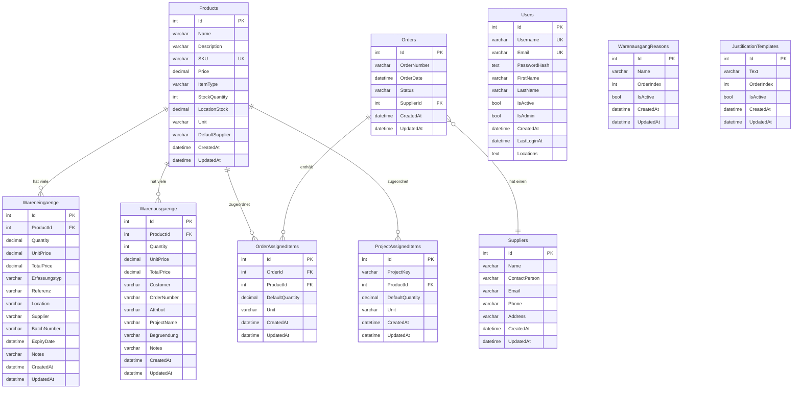

# Datenmodell - Warenbuchung App

## Übersicht

Dieses Dokument beschreibt das aktuelle Datenmodell der Warenbuchung-App mit allen Entitäten, ihren Eigenschaften und Beziehungen.

## Entitäten

### 1. Product (Produkt)
**Beschreibung:** Zentrale Entität für alle Produkte/Materialien im System.

**Eigenschaften:**
- `Id` (int, PK) - Eindeutige Identifikation
- `Name` (string, max 100, required) - Produktname
- `Description` (string, max 500, optional) - Produktbeschreibung
- `SKU` (string, max 50, required, unique) - Stock Keeping Unit (Artikelnummer)
- `Price` (decimal(18,2), required) - Standardpreis
- `ItemType` (string, max 50, default: "Gerät") - Typ des Artikels (z.B. "Material", "Gerät")
- `StockQuantity` (int, required) - Gesamtbestand
- `LocationStock` (decimal(18,2)) - Bestand am Lagerort
- `Unit` (string, max 50, optional) - Einheit (z.B. "Stück", "Sack", "Palette")
- `DefaultSupplier` (string, max 100, optional) - Standardlieferant
- `CreatedAt` (DateTime) - Erstellungsdatum
- `UpdatedAt` (DateTime?, optional) - Aktualisierungsdatum

**Beziehungen:**
- 1:N zu `Wareneingang`
- 1:N zu `Warenausgang`
- 1:N zu `OrderAssignedItem`
- 1:N zu `ProjectAssignedItem`

---

### 2. Wareneingang (Wareneingang)
**Beschreibung:** Erfasst eingehende Waren/Materialien.

**Eigenschaften:**
- `Id` (int, PK) - Eindeutige Identifikation
- `ProductId` (int, required, FK) - Referenz zum Produkt
- `Quantity` (decimal(18,2), required) - Menge
- `UnitPrice` (decimal(18,2)) - Einzelpreis
- `TotalPrice` (decimal(18,2)) - Gesamtpreis
- `Erfassungstyp` (string, max 50, optional) - Typ der Erfassung (z.B. "Bestellung", "Projekt")
- `Referenz` (string, max 100, optional) - Referenznummer (z.B. Bestellnummer)
- `Location` (string, max 100, optional) - Lagerort
- `Supplier` (string, max 100, optional) - Lieferant
- `BatchNumber` (string, max 50, optional) - Chargennummer
- `ExpiryDate` (DateTime?, optional) - Ablaufdatum
- `Notes` (string, max 500, optional) - Notizen
- `CreatedAt` (DateTime) - Erstellungsdatum
- `UpdatedAt` (DateTime?, optional) - Aktualisierungsdatum

**Beziehungen:**
- N:1 zu `Product` (Cascade Delete)

---

### 3. Warenausgang (Warenausgang)
**Beschreibung:** Erfasst ausgehende Waren/Materialien.

**Eigenschaften:**
- `Id` (int, PK) - Eindeutige Identifikation
- `ProductId` (int, required, FK) - Referenz zum Produkt
- `Quantity` (int, required) - Menge
- `UnitPrice` (decimal(18,2)) - Einzelpreis
- `TotalPrice` (decimal(18,2)) - Gesamtpreis
- `Customer` (string, max 100, optional) - Kunde
- `OrderNumber` (string, max 50, optional) - Auftragsnummer
- `Notes` (string, max 500, optional) - Notizen
- `Attribut` (string, max 50, optional) - Zusätzliches Attribut
- `ProjectName` (string, max 100, optional) - Projektname
- `Begruendung` (string, max 500, optional) - Begründung für Ausgang
- `CreatedAt` (DateTime) - Erstellungsdatum
- `UpdatedAt` (DateTime?, optional) - Aktualisierungsdatum

**Beziehungen:**
- N:1 zu `Product` (Cascade Delete)

---

### 4. Order (Bestellung)
**Beschreibung:** Verwaltet Bestellungen mit zugeordneten Lieferanten.

**Eigenschaften:**
- `Id` (int, PK) - Eindeutige Identifikation
- `OrderNumber` (string, max 100, required, indexed) - Bestellnummer
- `OrderDate` (DateTime, default: UtcNow) - Bestelldatum
- `Status` (string, max 50, optional) - Status der Bestellung
- `SupplierId` (int?, optional, FK) - Referenz zum Lieferanten (1:1 Beziehung)
- `CreatedAt` (DateTime) - Erstellungsdatum
- `UpdatedAt` (DateTime?, optional) - Aktualisierungsdatum

**Beziehungen:**
- 1:1 zu `Supplier` (SetNull on Delete)
- 1:N zu `OrderAssignedItem` (Cascade Delete)

---

### 5. Supplier (Lieferant)
**Beschreibung:** Verwaltet Lieferanteninformationen.

**Eigenschaften:**
- `Id` (int, PK) - Eindeutige Identifikation
- `Name` (string, max 100, required, indexed) - Lieferantenname
- `ContactPerson` (string, max 100, optional) - Ansprechpartner
- `Email` (string, max 100, optional) - E-Mail-Adresse
- `Phone` (string, max 50, optional) - Telefonnummer
- `Address` (string, max 500, optional) - Adresse
- `CreatedAt` (DateTime) - Erstellungsdatum
- `UpdatedAt` (DateTime?, optional) - Aktualisierungsdatum

**Beziehungen:**
- 1:N zu `Order` (SetNull on Delete)

**Hinweis:** Die Beziehung zwischen Order und Supplier ist **1:1** - jede Bestellung hat genau einen Lieferanten, aber ein Lieferant kann mehrere Bestellungen haben.

---

### 6. OrderAssignedItem (Bestellungszuordnung)
**Beschreibung:** Verknüpft Produkte mit Bestellungen und speichert Standardmengen.

**Eigenschaften:**
- `Id` (int, PK) - Eindeutige Identifikation
- `OrderId` (int, required, FK) - Referenz zur Bestellung
- `ProductId` (int, required, FK) - Referenz zum Produkt
- `DefaultQuantity` (decimal(18,2), default: 0) - Standardmenge
- `Unit` (string, max 50, default: "Stück") - Einheit
- `CreatedAt` (DateTime) - Erstellungsdatum
- `UpdatedAt` (DateTime?, optional) - Aktualisierungsdatum

**Beziehungen:**
- N:1 zu `Order` (Cascade Delete)
- N:1 zu `Product` (Cascade Delete)

**Constraints:**
- Unique Index auf (`OrderId`, `ProductId`) - Ein Produkt kann nur einmal pro Bestellung zugeordnet werden

---

### 7. ProjectAssignedItem (Projektzuordnung)
**Beschreibung:** Verknüpft Produkte mit Projekten (Baustellen) und speichert Standardmengen.

**Eigenschaften:**
- `Id` (int, PK) - Eindeutige Identifikation
- `ProjectKey` (string, max 100, required) - Projektkennung/Schlüssel
- `ProductId` (int, required, FK) - Referenz zum Produkt
- `DefaultQuantity` (decimal(18,2), default: 0) - Standardmenge
- `Unit` (string, max 50, default: "Stück") - Einheit
- `CreatedAt` (DateTime) - Erstellungsdatum
- `UpdatedAt` (DateTime?, optional) - Aktualisierungsdatum

**Beziehungen:**
- N:1 zu `Product` (Cascade Delete)

**Constraints:**
- Unique Index auf (`ProjectKey`, `ProductId`) - Ein Produkt kann nur einmal pro Projekt zugeordnet werden

---

### 8. User (Benutzer)
**Beschreibung:** Verwaltet Benutzer und deren Berechtigungen.

**Eigenschaften:**
- `Id` (int, PK) - Eindeutige Identifikation
- `Username` (string, max 100, required, unique, indexed) - Benutzername
- `Email` (string, max 200, required, unique, indexed) - E-Mail-Adresse
- `PasswordHash` (string, required) - Gehashtes Passwort
- `FirstName` (string, max 100, optional) - Vorname
- `LastName` (string, max 100, optional) - Nachname
- `IsActive` (bool, default: true, indexed) - Aktiv-Status
- `IsAdmin` (bool, default: false, indexed) - Admin-Status
- `CreatedAt` (DateTime) - Erstellungsdatum
- `LastLoginAt` (DateTime?, optional) - Letzter Login-Zeitpunkt
- `Locations` (string, optional) - Komma-separierte Liste von Lagerorten

**Beziehungen:**
- Keine direkten Beziehungen zu anderen Entitäten

---

### 9. WarenausgangReason (Grund für Warenausgang)
**Beschreibung:** Vordefinierte Gründe für Warenausgänge.

**Eigenschaften:**
- `Id` (int, PK) - Eindeutige Identifikation
- `Name` (string, max 100, required, indexed) - Name des Grundes
- `OrderIndex` (int, default: 0, indexed) - Sortierreihenfolge
- `IsActive` (bool, default: true) - Aktiv-Status
- `CreatedAt` (DateTime) - Erstellungsdatum
- `UpdatedAt` (DateTime?, optional) - Aktualisierungsdatum

**Beziehungen:**
- Keine direkten Beziehungen zu anderen Entitäten

---

### 10. JustificationTemplate (Begründungsvorlage)
**Beschreibung:** Vordefinierte Textvorlagen für Begründungen.

**Eigenschaften:**
- `Id` (int, PK) - Eindeutige Identifikation
- `Text` (string, max 500, required) - Vorlagentext
- `OrderIndex` (int, default: 0, indexed) - Sortierreihenfolge
- `IsActive` (bool, default: true) - Aktiv-Status
- `CreatedAt` (DateTime) - Erstellungsdatum
- `UpdatedAt` (DateTime?, optional) - Aktualisierungsdatum

**Beziehungen:**
- Keine direkten Beziehungen zu anderen Entitäten

---

## Beziehungsübersicht

### 1:N Beziehungen (One-to-Many)
- **Product → Wareneingang** (Cascade Delete)
- **Product → Warenausgang** (Cascade Delete)
- **Product → OrderAssignedItem** (Cascade Delete)
- **Product → ProjectAssignedItem** (Cascade Delete)
- **Order → OrderAssignedItem** (Cascade Delete)
- **Supplier → Order** (SetNull on Delete)

### N:1 Beziehungen (Many-to-One)
- **Wareneingang → Product**
- **Warenausgang → Product**
- **OrderAssignedItem → Order**
- **OrderAssignedItem → Product**
- **ProjectAssignedItem → Product**
- **Order → Supplier**

### 1:1 Beziehung
- **Order ↔ Supplier** (über SupplierId) - Jede Bestellung hat genau einen Lieferanten

---

## Indizes

### Unique Indizes
- `Product.SKU` - Eindeutige Artikelnummer
- `User.Username` - Eindeutiger Benutzername
- `User.Email` - Eindeutige E-Mail-Adresse
- `OrderAssignedItem(OrderId, ProductId)` - Eindeutige Kombination
- `ProjectAssignedItem(ProjectKey, ProductId)` - Eindeutige Kombination

### Standard Indizes
- `Product.SKU` (unique)
- `User.Username` (unique)
- `User.Email` (unique)
- `User.IsAdmin`
- `User.IsActive`
- `Order.OrderNumber`
- `Supplier.Name`
- `WarenausgangReason.Name`
- `WarenausgangReason.OrderIndex`
- `JustificationTemplate.OrderIndex`

---

## Löschverhalten (Delete Behavior)

- **Cascade Delete:**
  - Wenn ein `Product` gelöscht wird, werden alle zugehörigen `Wareneingang`, `Warenausgang`, `OrderAssignedItem` und `ProjectAssignedItem` Einträge gelöscht
  - Wenn eine `Order` gelöscht wird, werden alle zugehörigen `OrderAssignedItem` Einträge gelöscht

- **SetNull on Delete:**
  - Wenn ein `Supplier` gelöscht wird, wird `SupplierId` in den zugehörigen `Order` Einträgen auf `null` gesetzt

---

## Datenbank
- **Typ:** MariaDB 11.2.3
- **Datenbankname:** `warenbuchung`
- **Charset:** utf8mb4
- **Collation:** utf8mb4_unicode_ci
- **Engine:** InnoDB
- **ORM:** Entity Framework Core 9.0.10
- **Provider:** Pomelo.EntityFrameworkCore.MySql 9.0.0
- **Connection:** Unix Socket (`/tmp/mysql.sock`)
- **Benutzer:** `adammechouate` (mit Passwort geschützt)

---

## ER-Diagramm (Entity Relationship)



---

## Datenbankstruktur (MariaDB)

### Tabellenübersicht

| Tabelle | Beschreibung | Anzahl Spalten | Engine |
|---------|--------------|----------------|--------|
| `Products` | Produkte/Materialien | 12 | InnoDB |
| `Wareneingaenge` | Wareneingänge | 13 | InnoDB |
| `Warenausgaenge` | Warenausgänge | 12 | InnoDB |
| `Orders` | Bestellungen | 7 | InnoDB |
| `Suppliers` | Lieferanten | 8 | InnoDB |
| `OrderAssignedItems` | Bestellungszuordnungen | 7 | InnoDB |
| `ProjectAssignedItems` | Projektzuordnungen | 7 | InnoDB |
| `Users` | Benutzer | 10 | InnoDB |
| `WarenausgangReasons` | Gründe für Warenausgang | 6 | InnoDB |
| `JustificationTemplates` | Begründungsvorlagen | 6 | InnoDB |

### Detaillierte Tabellenstruktur

#### Products
```sql
CREATE TABLE `Products` (
  `Id` int(11) NOT NULL AUTO_INCREMENT,
  `Name` varchar(100) NOT NULL,
  `Description` varchar(500) DEFAULT NULL,
  `SKU` varchar(50) NOT NULL,
  `Price` decimal(18,2) NOT NULL,
  `ItemType` varchar(50) NOT NULL,
  `StockQuantity` int(11) NOT NULL,
  `LocationStock` decimal(18,2) NOT NULL,
  `Unit` varchar(50) DEFAULT NULL,
  `DefaultSupplier` varchar(100) DEFAULT NULL,
  `CreatedAt` datetime(6) NOT NULL,
  `UpdatedAt` datetime(6) DEFAULT NULL,
  PRIMARY KEY (`Id`),
  UNIQUE KEY `IX_Products_SKU` (`SKU`)
) ENGINE=InnoDB DEFAULT CHARSET=utf8mb4 COLLATE=utf8mb4_unicode_ci;
```

#### Foreign Keys

**Wareneingaenge → Products**
- `ProductId` → `Products.Id` (ON DELETE CASCADE)

**Warenausgaenge → Products**
- `ProductId` → `Products.Id` (ON DELETE CASCADE)

**Orders → Suppliers**
- `SupplierId` → `Suppliers.Id` (ON DELETE SET NULL)

**OrderAssignedItems → Orders**
- `OrderId` → `Orders.Id` (ON DELETE CASCADE)

**OrderAssignedItems → Products**
- `ProductId` → `Products.Id` (ON DELETE CASCADE)

**ProjectAssignedItems → Products**
- `ProductId` → `Products.Id` (ON DELETE CASCADE)

### Indizes

#### Unique Indizes
- `IX_Products_SKU` auf `Products.SKU`
- `IX_Users_Username` auf `Users.Username`
- `IX_Users_Email` auf `Users.Email`
- `IX_OrderAssignedItems_OrderId_ProductId` auf `OrderAssignedItems(OrderId, ProductId)`
- `IX_ProjectAssignedItems_ProjectKey_ProductId` auf `ProjectAssignedItems(ProjectKey, ProductId)`

#### Standard Indizes
- `IX_Orders_OrderNumber` auf `Orders.OrderNumber`
- `IX_Orders_SupplierId` auf `Orders.SupplierId`
- `IX_Suppliers_Name` auf `Suppliers.Name`
- `IX_Users_IsActive` auf `Users.IsActive`
- `IX_Users_IsAdmin` auf `Users.IsAdmin`
- `IX_WarenausgangReasons_Name` auf `WarenausgangReasons.Name`
- `IX_WarenausgangReasons_OrderIndex` auf `WarenausgangReasons.OrderIndex`
- `IX_JustificationTemplates_OrderIndex` auf `JustificationTemplates.OrderIndex`
- `IX_Wareneingaenge_ProductId` auf `Wareneingaenge.ProductId`
- `IX_Warenausgaenge_ProductId` auf `Warenausgaenge.ProductId`
- `IX_OrderAssignedItems_ProductId` auf `OrderAssignedItems.ProductId`
- `IX_ProjectAssignedItems_ProductId` auf `ProjectAssignedItems.ProductId`

---

## Seed-Daten

Die Datenbank wird mit folgenden Seed-Daten initialisiert:

- **24 Produkte** (Baustoffe, Materialien)
- **6 Benutzer** (3 Admins, 3 normale Benutzer)
- **4 Lieferanten** (Lieferant A, B, C, D)
- **8 Bestellungen** (verschiedene Status)
- **24 Bestellungszuordnungen** (OrderAssignedItems)
- **15 Projektzuordnungen** (ProjectAssignedItems)
- **4 Warenausgangsgründe** (Kommission, Auftrag, Umbuchung, Beschädigung)
- **8 Begründungsvorlagen** (JustificationTemplates)

---

## Version
- **Erstellt:** 2025-11-24
- **Letzte Aktualisierung:** 2025-11-25
- **Datenbank-Migration:** MariaDB 11.2.3 (2025-11-25)

