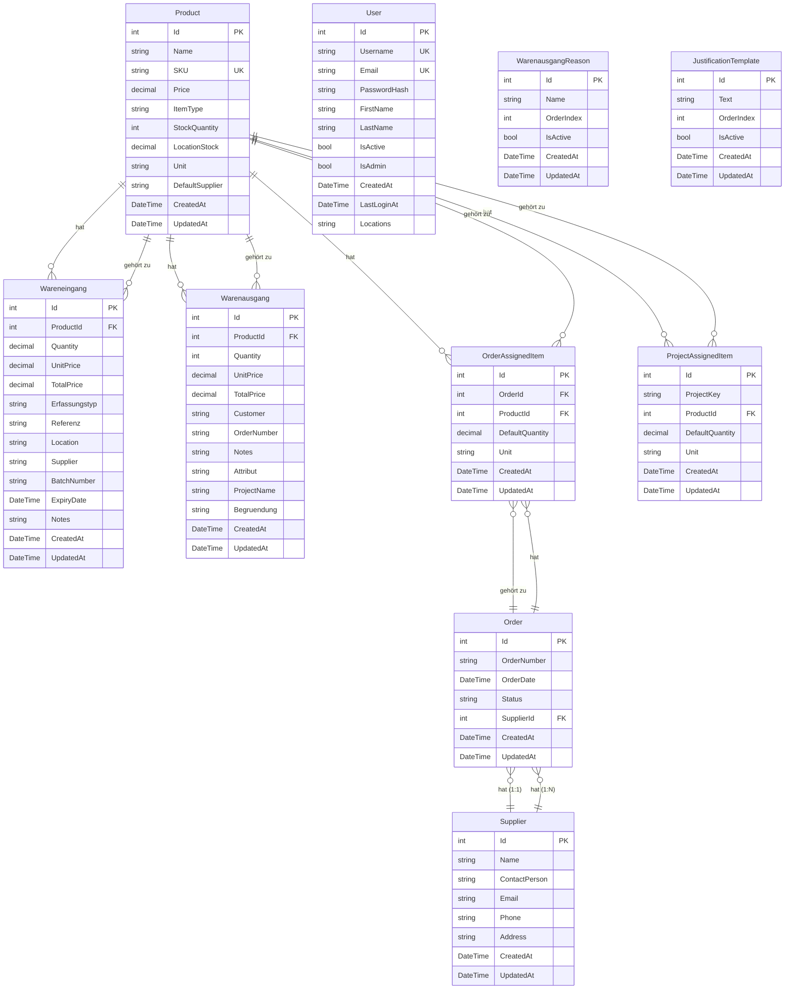

# Klassendiagramm - Warenbuchung App

## UML-Klassendiagramm (Mermaid)

```mermaid
classDiagram
    class Product {
        +int Id
        +string Name
        +string Description
        +string SKU
        +decimal Price
        +string ItemType
        +int StockQuantity
        +decimal LocationStock
        +string Unit
        +string DefaultSupplier
        +DateTime CreatedAt
        +DateTime? UpdatedAt
        +ICollection~Wareneingang~ Wareneingaenge
        +ICollection~Warenausgang~ Warenausgaenge
        +ICollection~OrderAssignedItem~ OrderAssignedItems
        +ICollection~ProjectAssignedItem~ ProjectAssignedItems
    }

    class Wareneingang {
        +int Id
        +int ProductId
        +decimal Quantity
        +decimal UnitPrice
        +decimal TotalPrice
        +string Erfassungstyp
        +string Referenz
        +string Location
        +string Supplier
        +string BatchNumber
        +DateTime? ExpiryDate
        +string Notes
        +DateTime CreatedAt
        +DateTime? UpdatedAt
        +Product Product
    }

    class Warenausgang {
        +int Id
        +int ProductId
        +int Quantity
        +decimal UnitPrice
        +decimal TotalPrice
        +string Customer
        +string OrderNumber
        +string Notes
        +string Attribut
        +string ProjectName
        +string Begruendung
        +DateTime CreatedAt
        +DateTime? UpdatedAt
        +Product Product
    }

    class Order {
        +int Id
        +string OrderNumber
        +DateTime OrderDate
        +string Status
        +int? SupplierId
        +DateTime CreatedAt
        +DateTime? UpdatedAt
        +Supplier Supplier
        +ICollection~OrderAssignedItem~ AssignedItems
    }

    class Supplier {
        +int Id
        +string Name
        +string ContactPerson
        +string Email
        +string Phone
        +string Address
        +DateTime CreatedAt
        +DateTime? UpdatedAt
        +ICollection~Order~ Orders
    }

    class OrderAssignedItem {
        +int Id
        +int OrderId
        +int ProductId
        +decimal DefaultQuantity
        +string Unit
        +DateTime CreatedAt
        +DateTime? UpdatedAt
        +Order Order
        +Product Product
    }

    class ProjectAssignedItem {
        +int Id
        +string ProjectKey
        +int ProductId
        +decimal DefaultQuantity
        +string Unit
        +DateTime CreatedAt
        +DateTime? UpdatedAt
        +Product Product
    }

    class User {
        +int Id
        +string Username
        +string Email
        +string PasswordHash
        +string FirstName
        +string LastName
        +bool IsActive
        +bool IsAdmin
        +DateTime CreatedAt
        +DateTime? LastLoginAt
        +string Locations
    }

    class WarenausgangReason {
        +int Id
        +string Name
        +int OrderIndex
        +bool IsActive
        +DateTime CreatedAt
        +DateTime? UpdatedAt
    }

    class JustificationTemplate {
        +int Id
        +string Text
        +int OrderIndex
        +bool IsActive
        +DateTime CreatedAt
        +DateTime? UpdatedAt
    }

    %% Beziehungen
    Product "1" --> "*" Wareneingang : "hat"
    Product "1" --> "*" Warenausgang : "hat"
    Product "1" --> "*" OrderAssignedItem : "hat"
    Product "1" --> "*" ProjectAssignedItem : "hat"
    
    Order "1" --> "*" OrderAssignedItem : "hat"
    Supplier "1" --> "*" Order : "hat"
    
    OrderAssignedItem "*" --> "1" Order : "gehört zu"
    OrderAssignedItem "*" --> "1" Product : "gehört zu"
    ProjectAssignedItem "*" --> "1" Product : "gehört zu"
    
    Wareneingang "*" --> "1" Product : "gehört zu"
    Warenausgang "*" --> "1" Product : "gehört zu"
    
    Order "1" --> "1" Supplier : "hat (1:1)"
```

## Erweiterte Darstellung mit Kardinalitäten



## Legende

- **PK** = Primary Key (Primärschlüssel)
- **FK** = Foreign Key (Fremdschlüssel)
- **UK** = Unique Key (Eindeutiger Schlüssel)
- **1** = Ein Element
- **\*** = Viele Elemente
- **o** = Optional (0 oder mehr)
- **||** = Genau eins (required)
- **}o** = Optional (0 oder 1)

## Wichtige Beziehungen

1. **Product** ist die zentrale Entität und hat Beziehungen zu:
   - Wareneingang (1:N)
   - Warenausgang (1:N)
   - OrderAssignedItem (1:N)
   - ProjectAssignedItem (1:N)

2. **Order ↔ Supplier** ist eine **1:1 Beziehung**:
   - Jede Bestellung hat genau einen Lieferanten
   - Ein Lieferant kann mehrere Bestellungen haben
   - Implementiert über `SupplierId` in der `Order` Tabelle

3. **OrderAssignedItem** ist eine Join-Tabelle zwischen:
   - Order und Product
   - Speichert zusätzlich `DefaultQuantity` und `Unit`

4. **ProjectAssignedItem** verknüpft:
   - Projekte (über `ProjectKey`) mit Produkten
   - Speichert zusätzlich `DefaultQuantity` und `Unit`

## Löschverhalten

- **Cascade Delete:** Wenn ein Product gelöscht wird, werden alle zugehörigen Wareneingänge, Warenausgänge, OrderAssignedItems und ProjectAssignedItems gelöscht
- **SetNull:** Wenn ein Supplier gelöscht wird, wird `SupplierId` in den zugehörigen Orders auf `null` gesetzt


